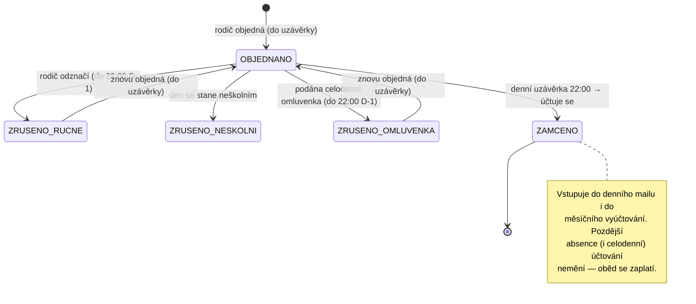

# PRD — Modul Obědy: objednávkový systém

**Produkt:** IS Nilsson (ZŠ Vilekula)
**Verze dokumentu:** v0.2 (jádro objednávek odsouhlaseno; otevřené zůstávají O5–O7)
**Stav:** analýza hotová pro objednávkové jádro → lze začít migrací 034. Platby/e-mail čekají na O5/O6.
**Návaznost:** modul Obědy / jídelníček (migrace 033, scraper SOSTP), modul Platby, Docházka/omluvenky, `school_holidays` (migrace 026)

---

## 1. Cíl a kontext

Rodiče (zákonní zástupci) objednávají dětem obědy ve školní jídelně **Dobrovolců (SOSTP)**, kde se žáci Vilekuly stravují. Nilsson je rodičovská vrstva nad tímto procesem: rodič objedná/zruší obědy, systém hlídá termíny a neškolní dny, jídelně se každý den odešle počet obědů na další den a škole vznikne podklad pro vyúčtování rodičům.

**Klíčová charakteristika:** objednává se **oběd na den**, nikoli konkrétní jídlo. Rodič objednává odebraný oběd; co si dítě vybere na místě (volba 1/2/3), se nikam neukládá. Jídelníček se v UI zobrazuje pouze **informativně**; objednávka váže na datum, ne na položku jídelníčku.

### Cíle
- Rodič snadno objedná/zruší obědy v měsíčním i týdenním pohledu.
- Systém automaticky vynechá/zruší dny, kdy se nevaří nebo je dítě celodenně omluvené.
- Jídelna dostane spolehlivý denní počet.
- Škola dostane měsíční podklad importovatelný do plateb.

### Nepatří do rozsahu (první verze)
- Výběr konkrétního jídla (volba 1/2/3).
- Obědy zaměstnanců.
- Evidence skutečného výdeje / odpich na čipy.
- Kapacitní limity jídelny.
- Přímá API integrace se systémem jídelny SOSTP (most je e-mail s počty).
- Samotný výběr plateb (řeší stávající modul Platby).
- Reakce na částečné (hodinové) omluvenky a na stažení omluvenky (viz §10 Předpoklady).

---

## 2. Uživatelské role

| Role | Oprávnění |
|---|---|
| **Zákonný zástupce** | Objednává/ruší obědy svým dětem; vidí evidenci a souhrn svých dětí. |
| **Personál (správce obědů)** | Vidí evidenci všech dětí; spouští měsíční import do plateb; spravuje ceny a neškolní dny; náhled/re-send denního mailu; ruční korekce. *(O7: kdo konkrétně.)* |
| **Systém (cron)** | Denní uzávěrka + odeslání mailu; synchronizace autorušení; scrape jídelníčku (033). |

---

## 3. Klíčové pojmy a datový model (konceptuálně)

> Bez DDL — jen entity, klíčová pole a vztahy.

**Objednávka oběda** (`lunch_orders`) — granularita **jeden žák × jeden den**:
- `student_id`, `menu_date` (UNIQUE dvojice)
- `status` (viz stavový model §6) — účtuje se právě stav `ZAMČENO`; samostatné pole `billable` není potřeba.
- `source` — jak vznikla: `monthly` | `weekly`
- `cancel_reason` — pokud zrušeno: `manual` | `non_school_day` | `omluvenka`
- `created_by` / `cancelled_by` (zákonný zástupce nebo systém), `created_at` / `cancelled_at`
- `school_year`

**Cena oběda** (`lunch_prices`) — *struktura k potvrzení (O5)*:
- podle věkové kategorie strávníka (typicky 7–10 / 11–14 / 15+ let, věk dosažený ve školním roce) a `school_year`
- jednotková cena, kterou účtuje SOSTP

**Napojené (existující) entity:**
- `lunch_menu_days` / `lunch_menu_items` (migrace 033) — informativní náhled v týdenním módu.
- `school_holidays` (migrace 026) — **jediný zdroj pravdy** o neškolních dnech vč. ředitelského volna (typ).
- Docházka / omluvenky — `datum od–do`, podporují budoucí datum; rodič podá i sám přes portál. Autorušení čte **podané** celodenní omluvenky.
- `payment_obligations` (typ `lunches`, SS prefix 70) — cíl měsíčního importu.

---

## 4. Funkční požadavky — Objednávání

### 4.1 Měsíční mód (calendar view)
- Rodič vidí kalendář měsíce a zaškrtává dny, které chce (např. jen čtvrtky).
- Tlačítka **vybrat vše / zrušit výběr** — „vybrat vše" označí **jen školní dny** (vynechá víkendy, prázdniny, ředitelské volno z `school_holidays`).
- Neškolní dny jsou nezaškrtnutelné (zašedlé).
- Dny po uzávěrce (viz §7) jsou zamčené (read-only).

### 4.2 Týdenní mód (this week)
- Pokud je pro daný týden natažený jídelníček (033): u každého dne se zobrazí **informativní** výpis jídel (polévka + volby 1/2/3, alergeny). Rodič zaškrtne dny — nevybírá jídlo.
- Pokud jídelníček v DB není: jen seznam dnů s konkrétním datem.
- Stejná pravidla pro neškolní dny a uzávěrku jako v měsíčním módu.

### 4.3 Společná pravidla
- Objednání je **opt-in** (default = neobjednáno).
- Při tvorbě se **vynechávají neškolní dny**.
- Objednávat lze nejpozději do **denní uzávěrky** dne předcházejícího (§7) — cutoff je symetrický s rušením.

---

## 5. Funkční požadavky — Rušení

> Objednávku odhlašují **pouze** §5.2 a §5.3, a to **jen do uzávěrky 22:00 D-1**. Cokoli po uzávěrce objednávkou nehne → oběd se účtuje. Rozhoduje **čas podání/akce proti uzávěrce**, ne úmysl.

### 5.1 Automatické — neškolní den
- Když se den stane neškolním (víkend, prázdniny, **ředitelské volno vyhlášené až po objednání**), existující objednávky se zruší (`cancel_reason = non_school_day`), neúčtuje se.
- Realizováno synchronizací nad `school_holidays`.
- Víkendy se nedají objednat vůbec (UI je nenabízí) — autorušení je pojistka.

### 5.2 Automatické — celodenní omluvenka
- **Podání** celodenní omluvenky (nikoli její schválení — to je formalita daná školním řádem) na daný den **do 22:00 D-1** odhlásí objednaný oběd, pokud byl přihlášen (`cancel_reason = omluvenka`), neúčtuje se.
- Spouštěčem je tedy podání; odhlášení oběda nečeká na pedagogické schválení absence.
- Omluvenka podaná/účinná **po uzávěrce** objednávkou nehne → oběd se účtuje.
- Pokrytí celého dne se opírá o provozní praxi (viz §10 Předpoklady); částečné omluvenky odhlášení nespouští.

### 5.3 Ruční — rodičem
- Ve stejném calendar view, odznačením dne, **nejpozději do 22:00 předchozího dne** (Europe/Prague; `≤ 22:00:00` ještě stihl). Neúčtuje se.

---

## 6. Stavový model objednávky

**Účtování:** do měsíčního souhrnu i denního mailu vstupují objednávky ve stavu `ZAMČENO`. Žádný neúčtovaný stav po uzávěrce neexistuje.

---

## 7. Termíny a denní uzávěrka

**Jediná denní uzávěrka 22:00 (Europe/Prague)** pro následující den. V tom okamžiku:
1. zamkne se objednávání i rušení daného dne (`ZAMČENO`),
2. doběhne autorušení podle podaných omluvenek a neškolních dnů do té chvíle,
3. odešle se mail s počty na další den (Resend).

22:00 je tak jediná konzistentní hranice → rodič nemůže zrušit oběd po odeslání mailu jídelně. Uzávěrka i cron drží **Europe/Prague** (pozor na letní/zimní čas), ne UTC.

---

## 8. Výstupy

### 8.1 Evidence po lidech a dnech
- Personál: mřížka (žáci × dny) za zvolený měsíc, filtr podle žáka/stavu.
- Rodič: totéž, jen pro vlastní děti.

### 8.2 Měsíční souhrn + import do plateb
- Za kalendářní měsíc: počet obědů (`ZAMČENO`) na každé dítě.
- Tlačítkem (**ruční** akce personálu) import do plateb: vytvoří/aktualizuje `payment_obligations` (typ `lunches`, SS 70), částka = počet × jednotková cena dle věkové kategorie *(O5)*.

### 8.3 Denní e-mail jídelně (Resend)
- Po uzávěrce odejde mail dle šablony s počtem obědů na následující den.
- *O6:* příjemce (kontakt jídelny Dobrovolců) a formát (celkový počet / jmenný seznam / rozpad po věkových kategoriích).

---

## 9. Integrace

| Systém | Použití | Směr |
|---|---|---|
| `school_holidays` (026) | neškolní dny vč. ředitelského volna | čtení |
| Docházka / omluvenky | autorušení podle podané celodenní omluvenky | čtení |
| Jídelníček (033) | informativní náhled v týdenním módu | čtení |
| Platby (`payment_obligations`) | měsíční import | zápis (ruční) |
| Resend | denní mail s počty | odchozí |
| Discord webhook | alerty crononů (uzávěrka/sync selhaly) | odchozí |

---

## 10. Předpoklady a edge cases

**Předpoklady:**
- **Omluvenky se podávají na celý den.** Docházka technicky umí i částečnou (hodinovou) absenci, ale provozně se to neděje. Pravidlo §5.2 na tom stojí — pokud se začnou podávat hodinové omluvenky, logika rušení se musí revidovat.
- Schválení omluvenky je formalita dle školního řádu; autorušení oběda se na něj neváže.
- Stažení omluvenky neřešíme (mimo rozsah).

**Edge cases:**
- **Dva zákonní zástupci jednoho dítěte** upravují stejnou objednávku → last-write-wins, oba vidí stejný stav. (Zvážit RPC se zámkem dle `reserve_tripartita_slot`.)
- **Změna věkové kategorie v průběhu roku** (narozeniny) → měsíční souhrn počítá kategorii k datu oběda.
- **Nástup/odchod žáka v půlce měsíce** → souhrn jen za dny v evidenci.
- **Ředitelské volno vyhlášené až po odeslání denního mailu** → den byl už nahlášen; ruční rekonciliace s jídelnou.
- **Změna jídelníčku re-scrapem po objednání** → bez dopadu (objednávka váže na den, ne na jídlo).
- **Týden bez nataženého jídelníčku** → týdenní mód ukáže jen data dnů.

---

## 11. Rozhodnutí

| # | Otázka | Stav / rozhodnutí |
|---|---|---|
| **O1** | Objednává se jen den, jídlo se nevybírá? | ✅ Ano — objednávka váže na datum, jídlo si dítě vybírá na místě a neukládá se. |
| **O2** | Zdroj pravdy o neškolních dnech? | ✅ `school_holidays` (026), ředitelské volno jako typ. Env nepoužívat. |
| **O3** | Logika omluvenky a účtování. | ✅ Odhlašuje jen ruční odznačení nebo podaná celodenní omluvenka, obojí do 22:00 D-1. Po uzávěrce se účtuje. Spouštěč = podání, ne schválení. |
| **O4** | Cutoff objednání = cutoff rušení? | ✅ Ano, symetrický; jedna denní uzávěrka 22:00 Europe/Prague. |
| **O8** | Budoucí omluvenky v docházce? | ✅ Ano (`datum od–do`), rodič i přes portál; autorušení čte podané celodenní omluvenky. |
| **O5** | Cena oběda a věkové kategorie pro import? | ⬜ Otevřené. Default: `lunch_prices` per kategorie × školní rok, zadává personál dle SOSTP. *(Blokuje import do plateb, §8.2.)* |
| **O6** | Příjemce a formát denního mailu? | ⬜ Otevřené. Default: kontakt jídelny Dobrovolců; rozpad po věkových kategoriích. *(Blokuje §8.3.)* |
| **O7** | Kdo z personálu spravuje obědy a spouští import? | ⬜ Otevřené. Default: ředitel + pověřená osoba (`has_role`). |

---

## 12. Hrubý plán

1. **Migrace 034:** `lunch_orders` (+ `lunch_prices`, jakmile O5), RLS + RPC dle kanonického vzoru portálu. *(Objednávkové jádro nezávisí na O5–O7.)*
2. Calendar view (měsíční + týdenní mód) v portálu.
3. Autorušení (sync nad `school_holidays` + podanými celodenními omluvenkami) + denní uzávěrka.
4. Denní mail (Resend) + alerty. *(Po O6.)*
5. Evidence + měsíční souhrn + import do `payment_obligations`. *(Po O5/O7.)*
